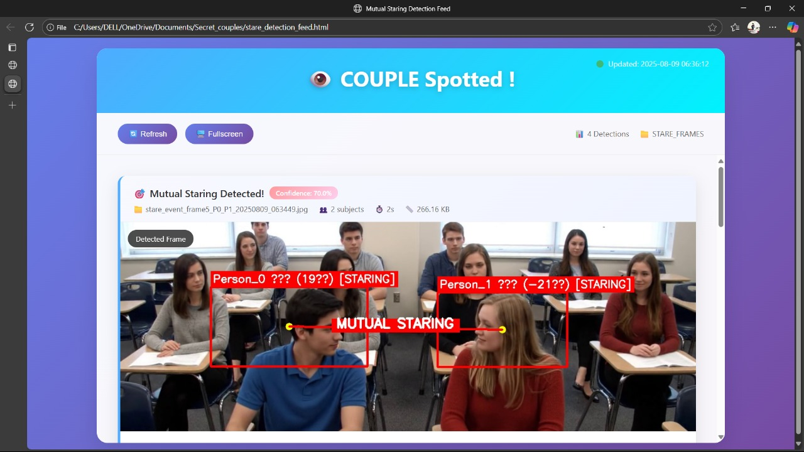

# Secret Couple Detector 🎯

## Basic Details
### Team Name: Bug Off!

### Team Members
- Member 1: Adhithyakrishna R - Muthoot Institute of Technology and Science
- Member 2: Elsa Prasad - Muthoot Institute of Technology and Science

### Project Description
A playful computer vision project built specifically for classroom surveillance to uncover only the “secret” couples.By measuring the physical distance between detected students and combining it with head pose estimation & gaze detection, the system filters out random glances and catches only those who sit suspiciously close and stare at each other for over a second.The results are automatically deployed in a Streamlit web app, where the evidence is displayed — frame by frame — for maximum classroom gossip impact.

### The Problem (that doesn't exist)
How do you scientifically prove who’s making googly eyes at whom during class without awkwardly staring at them yourself?

### The Solution (that nobody asked for)
We built an AI snitch that watches the class, detects mutual stares, and saves those exact frames. Basically, CCTV meets gossip.

## Technical Details
### Technologies/Components Used
For Software:
- *Languages:* Python
- *Frameworks:* OpenCV, Mediapipe, YOLOv8, Streamlit
- *Libraries:* NumPy, Ultralytics, dlib, imutils
- *Tools:* VSCode 

For Hardware:
- None — this project is entirely software-based
- Just a PC/Laptop with GPU (recommended for faster processing)

##Algorithm
- Person Detection (YOLOv8 : )Detects all students in the frame and marks their bounding boxes.
- Head Pose Estimation (Mediapipe/dlib)Determines the yaw (left/right rotation) of each detected head.
- Distance Filtering : Calculates the Euclidean distance between two people’s positions.Only pairs sitting within a set proximity threshold are considered potential couples.
- Mutual Gaze Detection : Checks if both individuals in a close pair are facing each other for more than 1 second.
- Evidence Capture : Saves the frame and tags the “caught” couple when conditions are met.
- Streamlit Deployment : Publishes all caught moments in a live web dashboard for instant viewing.

### Implementation
For Software:
# Installation

# Clone this repository  
git clone https://github.com/username/secret-couples-detector  
# Navigate into project folder  
cd secret-couples-detector  
# Install dependencies  
pip install -r requirements.txt 

# Run

# Run the main head detector (processes video + triggers gaze detection)
python head_detector.py

### Project Documentation
For Software:

# Screenshots (Add at least 3)

Green bounding boxes around all detected heads.

Red bounding boxes indicating mutual staring caught in the act.

Saved frame from a “caught” moment showed in website.

# Diagrams
Video → Head Detection → Gaze Tracking → Mutual Staring Detection → Save Evidence Frame → Published in website

For Hardware:

# Schematic & Circuit
Not Applicable

# Build Photos
Not Applicable

### Project Demo
# Video
https://drive.google.com/file/d/1ByUdyWkVFRReJWJDJOZoNEe7s6UzHTvP/view?usp=sharing
Shows the system processing a video, detecting heads, identifying mutual staring, and saving the caught moments into a web interface.

## Team Contributions
- *Adhithyakrishna R*: Core head detection logic, Gaze detection algorithm, web interface
- *Elsa Prasad*: YOLOv8 integration, testing & debugging.

---
Made with ❤️ at TinkerHub Useless Projects 

